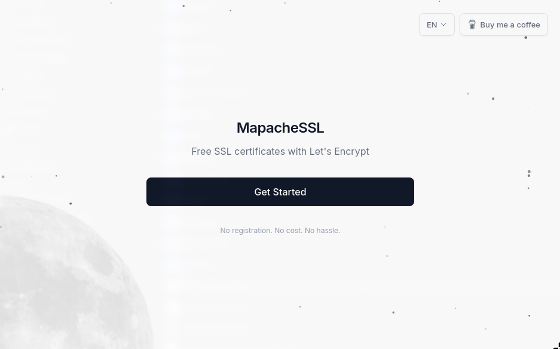

# MapacheSSL

Web wizard for issuing Let's Encrypt SSL certificates. The user enters a domain, picks HTTP or DNS validation, and downloads a ZIP with the cert, chain, and private key. Wildcards supported.

**Live demo:** <https://mapachessl.com>



Uses the ACME v2 protocol via `skoerfgen/acmecert` — no certbot dependency.

## Stack

Laravel 12, PHP 8.3, Alpine.js, Tailwind 4, Vite 7, SQLite. Docker for deployment.

## Setup

```bash
cp .env.example .env
docker compose up --build -d
docker compose exec app php artisan key:generate
docker compose exec app php artisan migrate
```

Open <http://localhost:8080>.

Local dev without Docker: `composer install && npm install && composer dev`.

## Configuration

In `.env`:

- `ACME_STAGING` — `true` for testing against Let's Encrypt staging (no rate limits, untrusted certs).

## Notes

- SQLite, single-node.
- No automatic renewal — each request is one-shot.
- HTTP-01 needs the domain pointing at a server you control on port 80.

## License

MIT.
